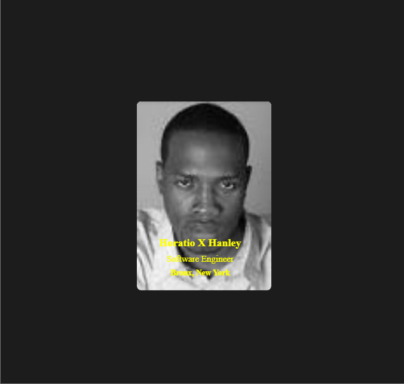

# Digital Business Card

This is a simple digital business card showcasing the professional details of Horatio X Hanley. The card has a sleek, modern design with a flip effect that displays the front with basic information and the back with a resume. The card is styled using CSS for a clean look and smooth flipping animation.

## Table of Contents
- [Live Demo](#live-demo)
- [Screenshot](#screenshot)
- [Features](#features)
- [Technologies Used](#technologies-used)

## Live Demo
Check out the live demo of this project: [Digital Business Card Demo](https://scrimba-horatio-digital-card.netlify.app/) <!-- Update with the link to your live demo -->

## Screenshot
 <!-- Make sure to replace with your actual image path -->

## Features
- Flip card animation that reveals professional details on the front and a resume on the back.
- Responsive and minimal design for digital business card use.
- Front side displays profile image, name, profession, and location.
- Back side displays a resume image.

## Technologies Used
- **HTML5** for markup structure.
- **CSS3** for styling and 3D card flipping animation.
- **Flexbox** for centering the card on the page.
- **Images** for the profile picture and resume.
